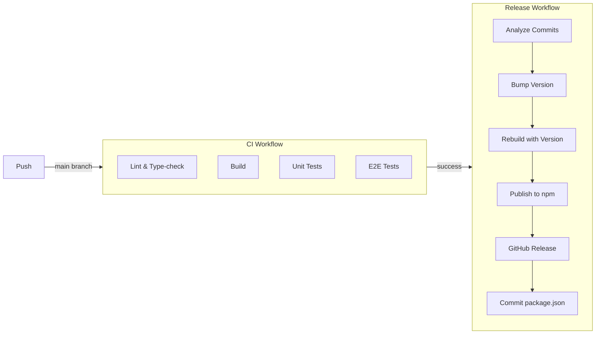
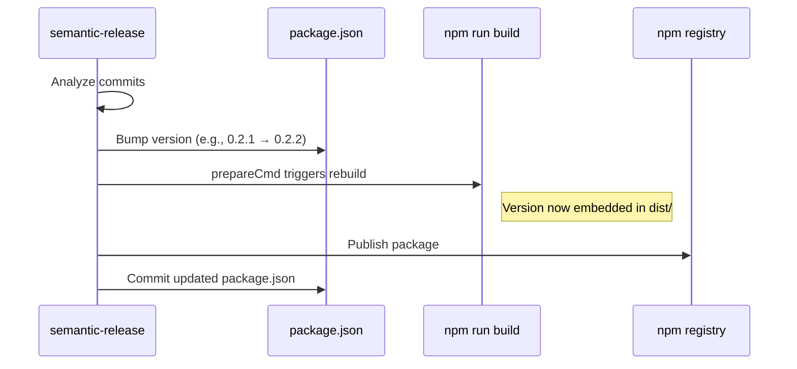

# Contributing

## CI/CD Flow



## Version Embedding

The version displayed in `GitHubCode.info` comes from `package.json` and is embedded at build time.



## Commit Conventions

This repo uses [Conventional Commits](https://www.conventionalcommits.org/) with semantic-release:

| Prefix | Release Type | Example |
|--------|--------------|---------|
| `fix:` | Patch (0.0.x) | `fix: theme change breaks tabs` |
| `feat:` | Minor (0.x.0) | `feat: add custom hljs url support` |
| `feat!:` or `BREAKING CHANGE:` | Major (x.0.0) | `feat!: rename file attribute` |
| `chore:`, `docs:`, `style:`, `refactor:`, `test:` | No release | `chore: update dependencies` |

## Development

```bash
npm install
npm run dev            # Watch mode
npm run test:ci        # Full CI check (lint + typecheck + build + tests)
```
