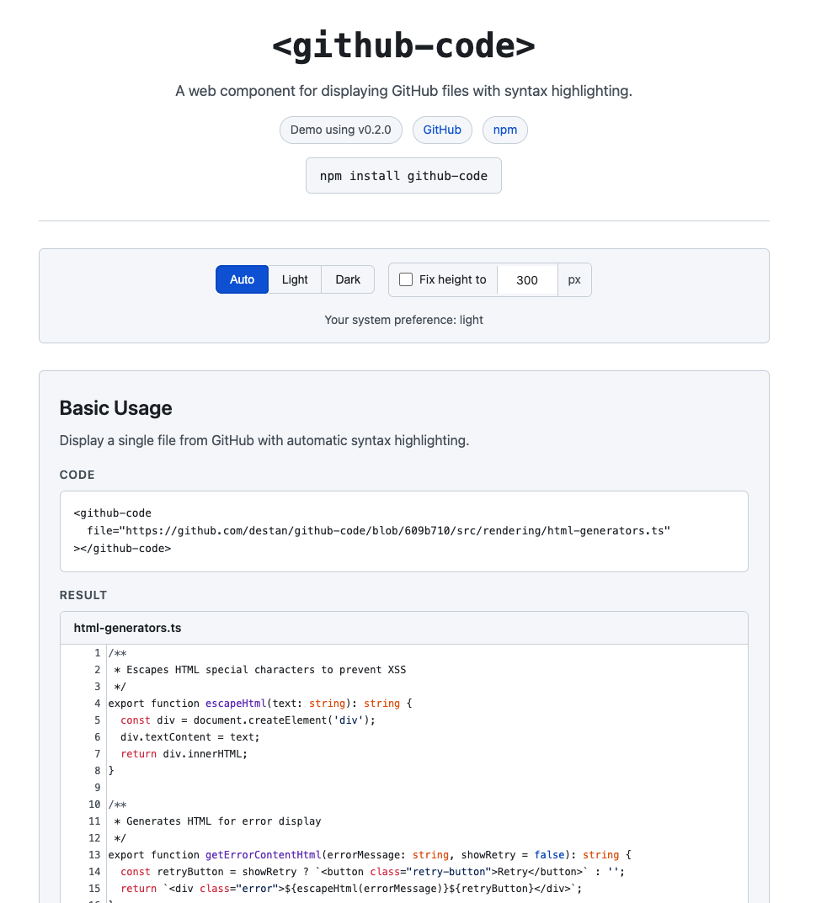
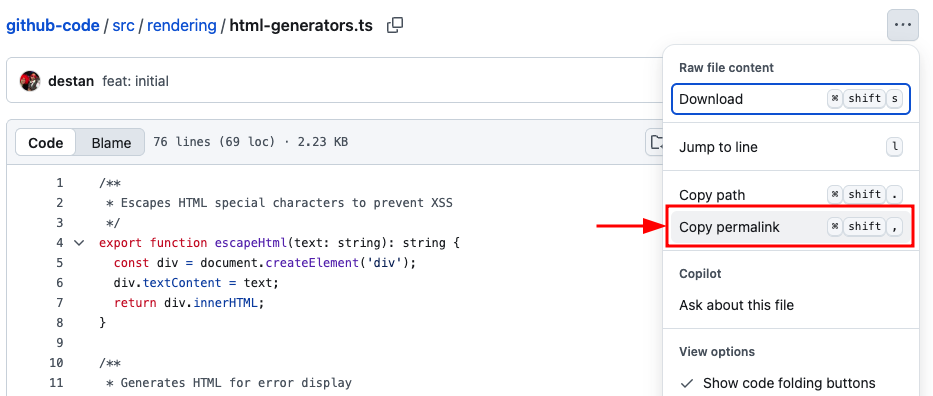

# github-code

[](https://www.npmjs.com/package/github-code)
[](https://bundlephobia.com/package/github-code)
[](https://github.com/destan/github-code/blob/main/LICENSE)
[](https://highlightjs.org/)

A web component for displaying GitHub files with syntax highlighting.

## Demo

See the live demo: **[github-code Demo](https://destan.github.io/github-code/)**



## Installation

Include the script in your HTML:

```html
<script type="module" src="https://cdn.jsdelivr.net/npm/github-code/dist/github-code.min.js"></script>
```

Or install via npm:

```bash
npm install github-code
```

## Usage

### Single File

```html
<github-code
  file="https://github.com/owner/repo/blob/main/src/example.ts">
</github-code>
```

### Multiple Files (Tabbed)

Comma-separate URLs to display files as tabs:

```html
<github-code
  file="https://github.com/owner/repo/blob/main/src/app.ts,
        https://github.com/owner/repo/blob/main/src/utils.ts">
</github-code>
```

## Attributes

| Attribute | Default     | Description                                                                                                                                                                       |
|-----------|-------------|-----------------------------------------------------------------------------------------------------------------------------------------------------------------------------------|
| `file` | _(required)_ | GitHub blob URL(s). Comma-separated for multiple files.                                                                                                                           |
| `theme` | `auto`      | `light`, `dark`, or `auto` (follows system preference)                                                                                                                            |
| `highlightjs-url` | `<empty>`   | <ul><li>If omitted, uses global `window.hljs` if available, otherwise uses jsDelivr CDN</li><li>Custom highlight.js URL. Omit to use global `window.hljs` if available.</li></ul> |

## URL Format

URLs must be GitHub blob URLs:

```
https://github.com/{owner}/{repo}/blob/{branch|commit}/{path}
```

Use the `permalink` of a file:



## Features

- Syntax highlighting via highlight.js (auto-detected language)
- Lazy loading (content fetched on demand)
- Keyboard-accessible tabs (Arrow keys, Home, End)
- CSP-compliant (no inline styles)
- Shadow DOM encapsulation

## Advanced Usage

### Custom highlight.js

By default, highlight.js is loaded from jsDelivr CDN. You can provide your own:

```html
<github-code
  file="https://github.com/owner/repo/blob/main/file.ts"
  highlightjs-url="https://your-cdn.com/highlight.min.js">
</github-code>
```

If highlight.js is already loaded globally (`window.hljs`), the component will use it automatically.

### Debugging

Access component info via the static property:

```javascript
console.log(GitHubCode.info);
// { version: "0.2.0", highlightjsUrl: "...", highlightjsSource: "cdn-default" }
```

## Troubleshooting

### Content Security Policy (CSP)

If using the default CDN and you have a strict CSP, add:

```
script-src https://cdn.jsdelivr.net;
```

Or use `highlightjs-url` to load from an allowed source.

## Development

```bash
npm install
npm run dev            # Watch mode
npm run test:ci        # Full CI check (lint + typecheck + build + tests)
npm run build          # Build dist files
```

## License

MIT
